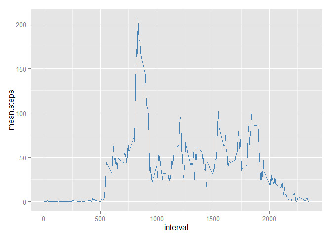

# Reproducible Research: Peer Assessment 1


## Loading and preprocessing the data

```r
    activity <- read.csv("activity.csv") # read in the data
    activity$date <- as.POSIXct(activity$date) # set the dates to POSIXct
    
    str(activity)
```

```
## 'data.frame':	17568 obs. of  3 variables:
##  $ steps   : int  NA NA NA NA NA NA NA NA NA NA ...
##  $ date    : POSIXct, format: "2012-10-01" "2012-10-01" ...
##  $ interval: int  0 5 10 15 20 25 30 35 40 45 ...
```

## What is mean total number of steps taken per day?

```r
    #Calculate the total number of steps taken per day
    dailysteps <- aggregate(activity$steps, by = list(activity$date), sum, na.rm=TRUE) 
    names(dailysteps) <- c("Date", "steps")
    
    #Make a histogram of the total number of steps taken each day
    library(ggplot2)
    

    histplot <- ggplot(dailysteps ,aes(x = steps)) +
            ggtitle("Histogram of daily steps") +
            xlab("Steps (binwidth 2000)") +
            geom_histogram(colour="blue",  fill="steelblue", binwidth = 2000, alpha=.5)
    histplot
```

 

```r
    #Calculate and report the mean and median of the total number of steps taken per day
    mean.steps <- mean(dailysteps$steps) 
    median.steps <- median(dailysteps$steps)

    
    #mean total number of steps taken per day
    mean.steps 
```

```
## [1] 9354.23
```

```r
    #median total number of steps taken per day
    median.steps 
```

```
## [1] 10395
```


## What is the average daily activity pattern?

```r
    #df of the mean and median number of steps taken, averaged across all days (y-axis)
    intsteps <- aggregate(activity$steps, by = list(activity$interval), mean, na.rm=TRUE)
    intstepsmed <- aggregate(activity$steps, by = list(activity$interval), median, na.rm=TRUE)
    
    intsteps <- cbind(intsteps[], intstepsmed$x)
    
    #Tidy the df names and round the numbers
    names(intsteps) = c("interval","mean.steps", "median.steps")
    intsteps$mean.steps <- round(intsteps$mean.steps)
    intsteps$median.steps <- round(intsteps$median.steps)
    
    
    ggplot(intsteps, aes(x = interval, y = mean.steps)) + geom_line(colour="steelblue") 
```

 

```r
    most.steps <- intsteps$interval[intsteps$mean.steps == max(intsteps$mean.steps)]
    
    #The 5-min time interval contains the maximum number of steps?
    most.steps
```

```
## [1] 835
```


## Imputing missing values

```r
   #find the NAs
    na.steps <- subset(activity, is.na(steps))
    num.NAs <-length(na.steps$steps)
    
    #total number of missing values in the dataset
    num.NAs
```

```
## [1] 2304
```

```r
    #replace the NAs with the median number of steps for that period
    nstps <- data.frame(date=activity$date[is.na(activity$steps)], interval = activity$interval[is.na(activity$steps)], steps=intsteps[match(intsteps$interval, activity$interval[is.na(activity$steps)]),3])
    
    # remove the NA's from the period
    activity <- subset(activity, !is.na(steps))
    
    # Append the median steps to the Activity DF
    activity <- rbind(activity, nstps)
    
    #sum the number of steps each day into the dailysteps2 DF and get the mean and median 
    dailysteps2 <- aggregate(activity$steps, by = list(activity$date), sum, na.rm=TRUE)
    names(dailysteps2) <- c("Date", "steps")
    
     
    histplot <- ggplot(dailysteps2,aes(x = steps)) +
            ggtitle("Histogram of daily steps after imputation") +
            xlab("Steps (binwidth 2000)") +
            geom_histogram(colour="blue",  fill="steelblue", binwidth = 2000, alpha=.5)
    histplot 
```

 

```r
    mean.steps2 <- mean(dailysteps2$steps) 
    median.steps2 <- median(dailysteps2$steps)
 
    #mean total number of steps taken per day
    mean.steps2
```

```
## [1] 9503.869
```

```r
    #median total number of steps taken per day
    median.steps2
```

```
## [1] 10395
```


## Are there differences in activity patterns between weekdays and weekends?

```r
    # Add the Weekday/weekend identifier
    activity$week <- ifelse(weekdays(activity$date) == "Saturday" | weekdays(activity$date) == "Sunday" ,"weekend","weekday")
    
    # df of the mean and median number of steps taken, averaged across all days (y-axis)
    intsteps2 <- aggregate(activity$steps, by = list(activity$week, activity$interval), mean, na.rm=TRUE)
    intstepsmed2 <- aggregate(activity$steps, by = list(activity$week, activity$interval), median, na.rm=TRUE)
    
    intsteps2 <- cbind(intsteps2[], intstepsmed2$x)
    
    # Tidy the df names and round the numbers
    names(intsteps2) = c("weekday", "interval","mean.steps", "median.steps")
    intsteps2$mean.steps <- round(intsteps2$mean.steps)
    intsteps2$median.steps <- round(intsteps2$median.steps)
    
    
    ggplot(intsteps2, aes(x = interval, y = mean.steps)) + ylab("Number of Steps") + geom_line(colour="steelblue") + facet_grid(weekday~.) 
```

 
